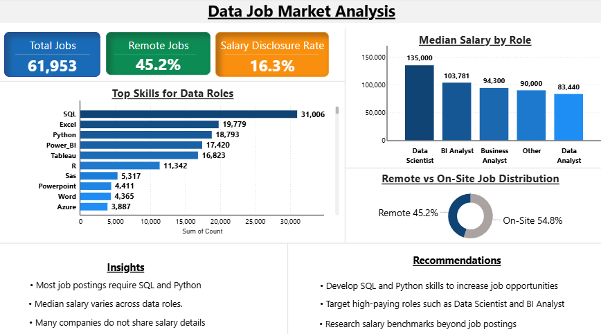

# 📊 Data Job Market Analysis

## 📌 Overview

This project presents a data-driven analysis of the data job market, focusing on skill demand, salary trends, and job characteristics. The dataset was cleaned and transformed using Python, with insights visualized through an interactive Power BI dashboard.

---

## 🎯 Objectives

* Identify in-demand skills for data roles
* Analyze salary trends across job positions
* Understand remote work distribution
* Evaluate salary transparency in job postings

---

## 📂 Dataset

This project uses a dataset sourced from Kaggle:

* https://www.kaggle.com/datasets/lukebarousse/data-analyst-job-postings-google-search

Due to file size limitations, the full dataset is not included in this repository. A sample of the cleaned dataset is provided.

---

## ⚙️ Data Processing

Data cleaning and preprocessing were performed using Python (VS Code). Key steps include:

* Handling missing values
* Standardizing column formats
* Creating new features (e.g., role, salary ranges, remote flag)
* Preparing structured data for analysis

---

## 💻 Code

The data cleaning and preprocessing script is available in:

* `data_cleaning.py`

This script includes data transformation, feature engineering, and preparation for visualization.

---

## 📊 Dashboard

The cleaned dataset was visualized using Power BI to generate insights on:

* Top in-demand skills
* Salary distribution by role
* Remote vs on-site job trends
* Salary disclosure patterns

---

## 📈 Key Insights

* SQL and Python are the most in-demand skills
* Median salary varies by data role
* Salary transparency is low across job postings

---

## 💡 Recommendations

* Prioritize SQL and Python to improve job prospects
* Target high-paying roles such as Data Scientist and BI Analyst
* Use external sources to evaluate salary benchmarks

---

## 🛠 Tools & Technologies

* Python (Pandas, VS Code)
* Power BI
* Excel

